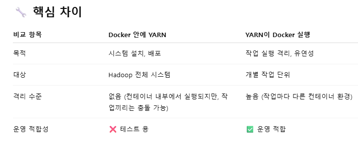

# < HDFS summary >
## 1. YARN?
- Spark, Flink, Hive 등이 HDFS를 활용하려 하면 YARN이 적당한 서버에 container를 생성 및 실행한다.
    - YARN container != Docker container
    - YARN의 contianer는 `리소스`를 논리적으로 묶은 실행 단위.
        - 즉, OS 안에서 단순히 자원을 할당하여 프로세스를 격리.

