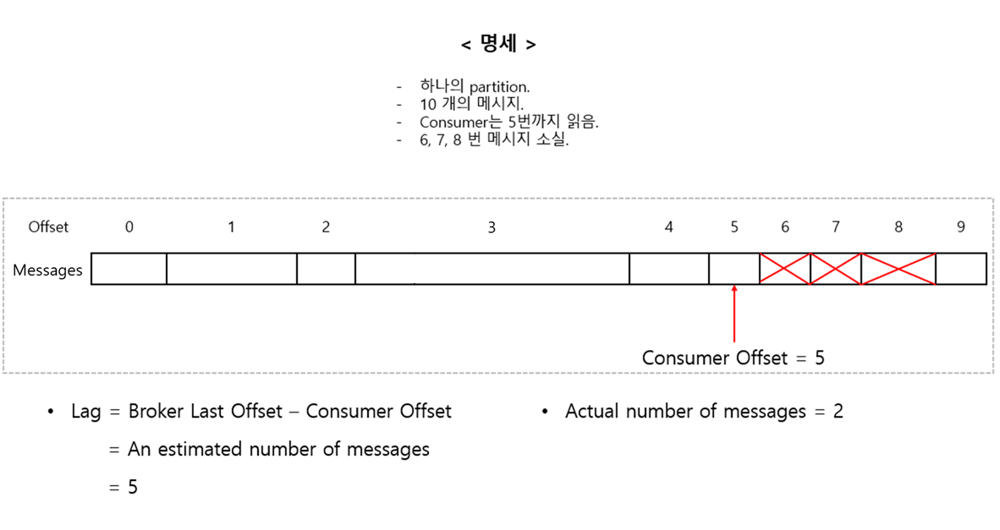

## < 1. Producer, Brokder, 그리고 Consumer의 구조 >
- Kafka의 broker들은 개별 port 번호를 부여 받는다.
    - 이렇게 개별적으로 port를 부여받는 이유는 `분산 병렬처리`를 위해서이다.
- 단, Producer는 port 번호로 broker에 접근하지 않는다.
    - 대신 bootstrap_servers로 kafka에 접속한다.
    - 이후 kafka가 알아서 적절한 broker에 `자동 분산 접근`을 시키는 방식이다.
- Consumer 또한 직접적으로 port에 접근하지 않는다.
    - Producer와 동일하게 kafka에 접근하면 kafka가 알아서 메타데이터를 기반으로 적절한 broker에 `자동 분산 접근`을 수행한다.
    - 단, Consumer는 반드시 `토픽` 단위로 kafka에서 데이터를 구독해야 한다.
        - `토픽`이 데이터 흐름의 `논리적 분리 단위`이기 때문이다.
        - `토픽`으로 접근한면 kafka에서 알아서 위치를 찾아 준다. (메타데이터를 활용).
**port로 분산 병렬처리를 구현하기는 하지만 Producer와 Consumer 모두 port로 접근하는 것이 아님을 기억해야 한다. 대신 브로커의 주소 + 공용포트로 접근.**

## < 2. Offset >
- Offset은 partition 별로 부여되는 index이다.
- Offset은 0부터 시작하며 순차적으로 번호가 증가한다.
    - 예를 들어 10 개의 메시지가 있는 경우 offset은 (0, 1, 2, 3, 4, 5, 6, 7, 8, 9)가 된다.
- Kafka는 `broker`와 `consumer`가 offset을 갖는다.
    - Broker: 메시지의 저장 순서를 나타내는 `논리적 번호`.
        - 메시지의 수를 의미하지는 않는다.
            - Offset은 중간의 메시지가 삭제되어도 그대로 유지되기 때문.
    - Consumer: 어디까지 메시지를 읽었는지를 기억하기 위한 `위치 정보`.
        - `Broker의 마지막 offset과 consumer offset`의 차이를 통해 아직 읽지 못한 대락적인 메시지의 수를 추정할 수 있다.
            - 왜 `추정`인가? 앞서 이야기한 것과 같이 메시지가 삭제 되어도 offset은 유지되기 때문이다.
- `Broker의 마지막 offset - consumer의 offset = 대략적인 메시지의 수`
    - 예를 들어 10 개의 메시지가 있고, consumer는 5까지 읽었으며 6, 7, 8의 메시지가 삭제된 상황이면 식은 다음과 같다.\
    &rightarrow; 10 - 5 = 5.\
    &rightarrow; 그러나 실제로는 6, 7, 8 메시지가 삭제되었기에 메시지의 수는 2가 되어야 한다.\
    &rightarrow; 이 점에서 `대략적인 메시지의 수`를 추정할 수 있다는 것이다. 

## < 3. Offset을 통한 접근 >
- 원하는 메시지의 offset을 찾는다.\
&rightarrow; offset을 통해 물리적인 파일 위치를 찾는다.\
&rightarrow; 해당 위치의 메시지를 반환한다.

